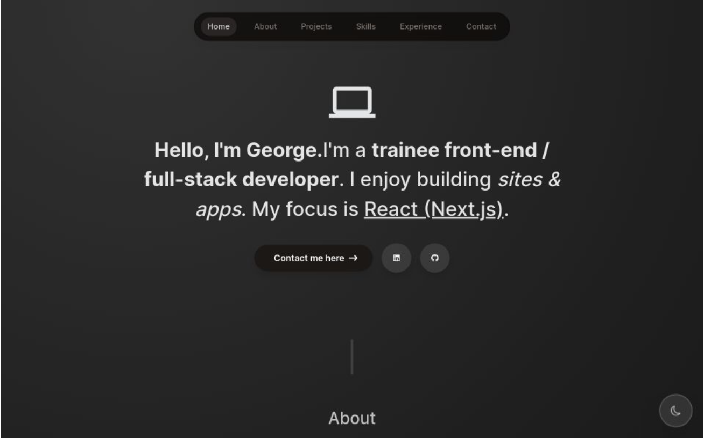

# Portfolio

Welcome to my portfolio! Here you'll find an overview of my latest projects, skills, and experience. This portfolio is built with the latest technologies and features to showcase my work effectively.

## Features

- **Latest Next.js 14 features**: Leveraging the newest capabilities of Next.js to ensure performance, scalability, and developer productivity.
- **Next.js App Router**: Utilizing Next.js routing for seamless navigation between pages and components.
- **Client & Server Components**: Incorporating both client-side and server-side components for optimal performance and user experience.
- **TypeScript (Beginner & Intermediate)**: Employing TypeScript for static typing, improving code quality, and enhancing developer productivity.
- **Tailwind CSS**: Styling the portfolio with Tailwind CSS for rapid development and responsive design.
- **Context API**: Managing state and data with React's Context API for a centralized and efficient data flow.
- **Advanced Animations with Framer Motion**: Enhancing the user interface with advanced animations using Framer Motion library.
- **React.Email & Resend**: Integrating React.Email for sending emails and allowing users to resend messages.
- **Custom React Hooks**: Creating custom React hooks for reusable logic and improving code organization.
- **Fresh, modern UI design**: Designing a modern and visually appealing user interface to showcase projects and skills effectively.
- **Light & Dark mode**: Providing both light and dark modes for improved accessibility and user preference.
- **Responsive website**: Ensuring the portfolio is fully responsive across various devices and screen sizes for a seamless browsing experience.

## Technologies Used

- Next.js
- TypeScript
- Tailwind CSS
- Framer Motion
- React.Email
- Context API

This portfolio is fully tested to ensure reliability. The testing includes:

- **Unit Testing with Jest**: Ensuring individual components behave as expected.
- **Integration Testing**: Verifying the interactions between components and modules.
- **End-to-End Testing with React Testing Library (RTL)**: Testing the entire application from the user's perspective.

## Getting Started

To run the portfolio locally, follow these steps:

1. Clone the repository.
2. Install dependencies using `npm install`.
3. Start the development server with `npm run dev`.
4. Open your browser and navigate to `http://localhost:3000`.

## Feedback

I'm always open to feedback! If you have any suggestions, questions, or just want to say hello, feel free to reach out to me. Your feedback helps me improve and grow as a developer.
